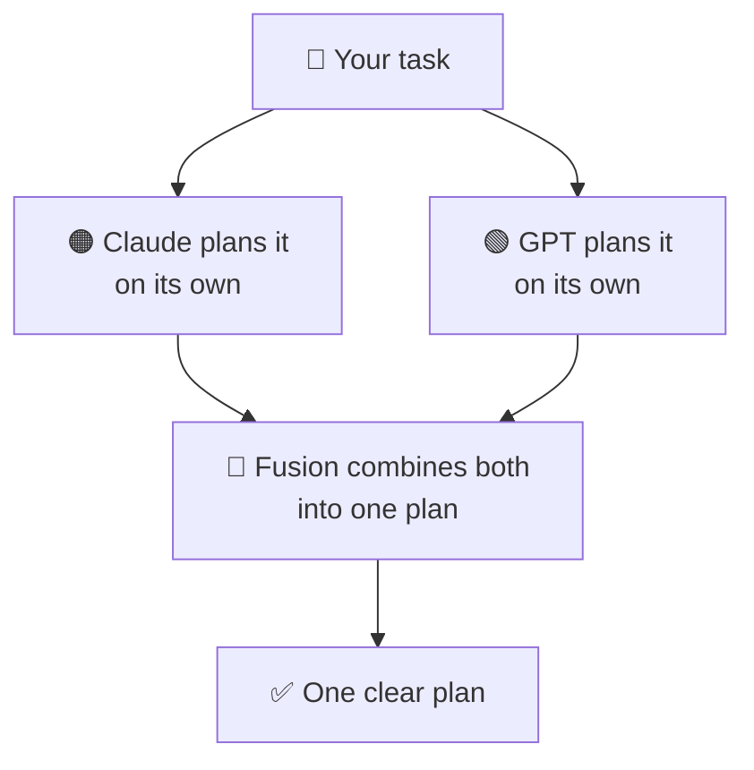

# 🔀 Fusion

**Two of the best AI models — Claude and GPT — plan your hardest tasks together, so you catch more and miss less.**

Fusion is a plugin for [Claude Code](https://claude.com/claude-code). When a task is big or tricky, one model alone can miss things. So Fusion has **Claude and GPT think it through independently** — each one filling gaps, questioning assumptions, and catching what the other might overlook. Then it hands you **one clear plan** to build from. It runs on the AI tools you already pay for, so there's **no extra cost**.

---

## How it works

1. **You give Fusion a task** — something big, tricky, or where you'd just like a second opinion.
2. **Claude and GPT each make their own plan.** Neither one sees the other's answer, so you don't get just one model's view — you get two.
3. **Fusion puts them together into one plan.** If the two models disagreed on something, it tells you instead of hiding it.
4. **You get one clear plan** you can start building from — saved on your own computer, so you can come back to it later.

## What you need

- You need a paid Claude Code plan.
- You need a paid Codex plan.
- You should be logged in to your Codex account.
- Bun should be installed on your system.

## Get started

1. `/plugin marketplace add Adityalingwal/Fusion`
2. `/plugin install fusion@fusion`
3. `/fusion <your task>`

## Usage

| Command | What it does |
|---|---|
| `/fusion <your task>` | Run Fusion on a task and get one clear plan |
| `/fusion dashboard` | Open a local page to browse your past runs |

## When to use it · When to skip it

| Use Fusion when… | Skip it when… |
|---|---|
| The task is big, or you're not sure how to approach it | It's a tiny change — a typo or a one-line fix |
| You'd like to see more than one point of view | You already know exactly what to do |

## Privacy

Everything stays on your machine — your runs are saved locally, and nothing is sent anywhere except to the Claude and Codex tools you already use.

## License

MIT © 2026 Aditya Lingwal — see [LICENSE](LICENSE).
