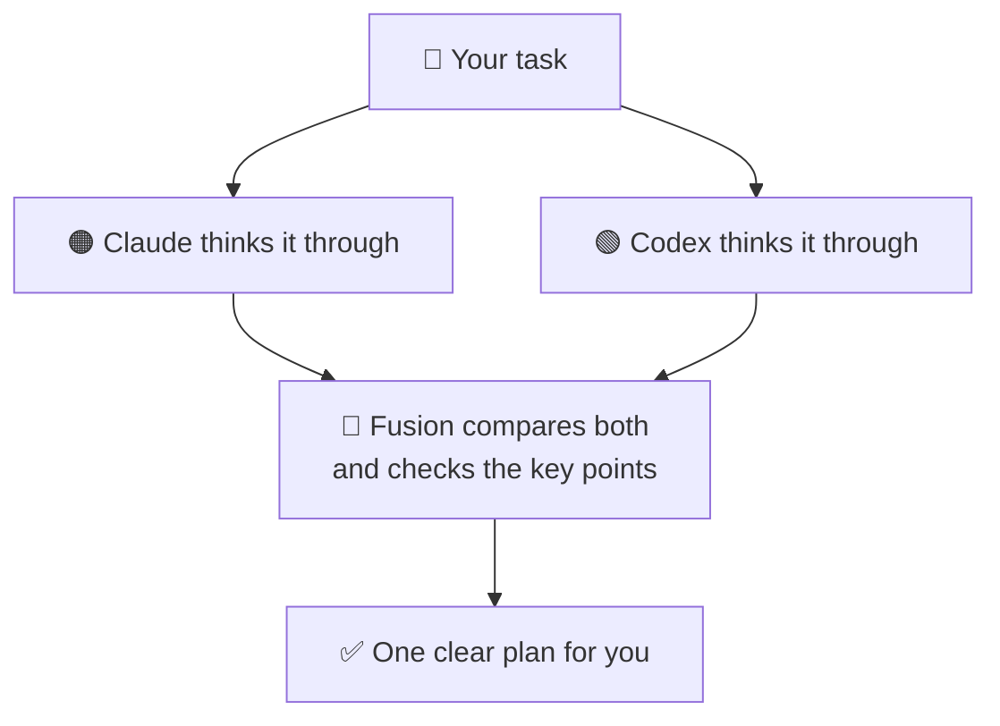

# 🔀 Fusion

**Fusion puts two powerful AI models — Claude and Codex — to work on your hardest tasks together, so you get a stronger result.**

[](LICENSE)
[](https://bun.sh)
[](https://claude.com/claude-code)


Fusion is a plugin for [Claude Code](https://claude.com/claude-code). When you have a big or tricky task, it asks **two AI models — Claude and Codex — to think about it separately**, then gives you **one clear plan** that combines their best ideas. It only *plans* the work — it never changes your code — and it uses the AI tools you already pay for, so there's **no extra cost**.



---

## How it works

1. You give Fusion your task.
2. Claude and Codex each work on it **on their own** — neither sees the other's answer, so you get two honest, independent takes.
3. Fusion **compares the two**, checks the important points, and keeps any disagreements visible instead of hiding them.
4. You get **one clear plan**. Every run is saved on your own computer, so you can look back at it later.

## Why Fusion

- **Two minds, not one.** Two strong models look at your task, so you catch more and miss less.
- **No extra cost.** It uses your existing Claude and Codex — you pay nothing more.
- **It plans, it doesn't touch your code.** Safe by default.
- **Everything stays on your computer.** Nothing is sent anywhere else.

## Get started

```
# 1. Add Fusion as a plugin source
/plugin marketplace add Adityalingwal/Fusion

# 2. Install it
/plugin install fusion@fusion

# 3. Run your first plan
/fusion:fusion plan <your task here>
```

## What you need

- **[Bun](https://bun.sh)** — the tool Fusion runs on.
- **[Codex CLI](https://github.com/openai/codex)**, installed and logged in (`codex login`). Fusion uses whatever model you've already set in your own Codex settings — you don't configure anything here.
- **[Claude Code](https://claude.com/claude-code)** — where you run Fusion.

## Usage

| Command | What it does |
|---|---|
| `/fusion:fusion plan <task>` | Run Fusion on a task and get one clear plan |
| `/fusion:fusion` → dashboard | Open a local page to browse your past runs |
| `bun "${CLAUDE_SKILL_DIR}/fusion.ts" doctor` | Check that everything is set up correctly |

## When to use it · When to skip it

| Use Fusion when… | Skip it when… |
|---|---|
| The task is big, or you're not sure how to approach it | It's a tiny change — a typo or a one-line fix |
| You want a plan *before* writing any code | You just want the code, not a plan |
| You'd like to see more than one point of view | You already know exactly what to do |

## Privacy

Everything stays on your machine — your runs are saved locally, and nothing is sent anywhere except to the Claude and Codex tools you already use. While Codex works, it can only *read* your project — it can't change anything.

## Development

```
bun install    # dev setup
bun test       # run the tests
```

Only the `plugin/` folder ships to users; `tests/`, `scripts/`, and `build/` are for development and never ship.

## Status

Fusion is **early (v0.1.0)** — it works and it's tested, but it's still growing. If you hit a rough edge, please open an issue.

## License

MIT © 2026 Aditya Lingwal — see [LICENSE](LICENSE).
