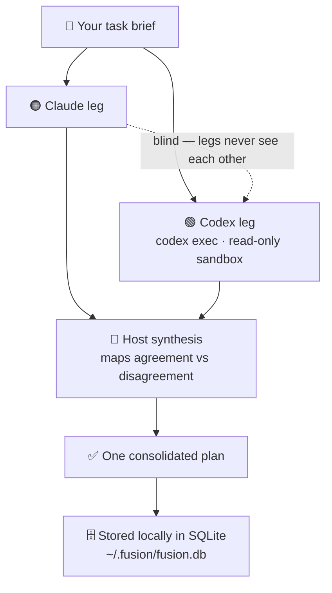

# 🔀 Fusion

**Two AI models plan your task independently. One consolidated plan comes out — with their disagreements kept visible, not hidden.**

[](LICENSE)
[](https://bun.sh)
[](https://claude.com/claude-code)


Fusion is a **planning council** for [Claude Code](https://claude.com/claude-code). It runs your brief through **Claude and Codex at the same time**, blind to each other, then the host synthesizes **one plan**. It is **plan-only** — it designs the work, it does not touch your code. And because it drives your already-installed `codex` CLI, there is **no extra API cost** beyond the subscriptions you already have.



---

## How it works (the 30-second version)

1. You invoke Fusion with a task brief.
2. Fusion spins up a **Codex leg** (via `codex exec`, in a read-only sandbox) while Claude writes its **own leg blind** — neither model sees the other's work, so neither anchors on it.
3. The host reads both reports and maps where they **agree** and where they **disagree**.
4. It synthesizes a **single consolidated plan** that keeps the disagreements visible instead of papering over them.
5. Every run (brief, both legs, final plan) is stored locally in SQLite at `~/.fusion/fusion.db`. A local dashboard lets you browse past runs.

## Why Fusion

- **Disagreements stay visible.** Two independent models rarely agree on everything — Fusion surfaces the conflicts so *you* make the call, instead of one model quietly winning.
- **No extra API cost.** It drives your existing `codex` CLI, which uses your own ChatGPT/Codex subscription and `~/.codex/config.toml`. You pay nothing beyond what you already have.
- **Plan-only, so it's safe.** Fusion produces a plan and stops. It never writes into your project.
- **Local & private.** Every run lives on your own machine. Nothing is sent anywhere except to the `codex` and `claude` CLIs you already use.

## Quick start (60 seconds)

```
# 1. Add this repo as a plugin marketplace
/plugin marketplace add Adityalingwal/Fusion
#   ...or from a local checkout:
/plugin marketplace add /path/to/fusion

# 2. Install the plugin
/plugin install fusion@fusion

# 3. Run your first plan
/fusion:fusion plan <your task here>
```

## Prerequisites

- **[bun](https://bun.sh)** — the runtime Fusion is built on. `bun:sqlite` is built in, so no `bun install` is needed to *run* the plugin.
- **[codex CLI](https://github.com/openai/codex)**, installed and **authenticated** (`codex login`). Fusion reads the **model and reasoning effort from your own `~/.codex/config.toml`** — it never pins a specific model, so whatever you configure is what it uses.
- **[Claude Code](https://claude.com/claude-code)** (`claude`) — the host that runs the plugin and does the synthesis.

## Usage

Invoke the skill from inside Claude Code:

```
/fusion:fusion plan <your task here>
```

Fusion runs both legs, synthesizes the plan, and prints it. Other commands:

| Command | What it does |
|---|---|
| `/fusion:fusion plan <task>` | Run a full planning council and print the consolidated plan |
| `/fusion:fusion` → dashboard step | Launch the on-demand local web UI to browse past runs |
| `bun "${CLAUDE_SKILL_DIR}/fusion.ts" doctor` | Health-check your prerequisites (bun, codex auth, Claude Code) |

## When to use · When to skip

| Use Fusion when… | Skip Fusion when… |
|---|---|
| The task is large or ambiguous and two perspectives help | The change is trivial (a typo, a one-liner, a rename) |
| You want a plan *before* any code is written | You want code right now, not a plan |
| You want the trade-offs surfaced, not decided for you | You already know exactly what to do |

## What's inside

- **Runner + host split.** A deterministic runner drives the external Codex relay (`codex exec`, hard timeout, fail-open); the host (Claude Code) contributes its own leg and does the final synthesis.
- **SQLite storage.** Each run — the brief, both leg reports, and the final plan — lives in one local SQLite DB (`~/.fusion/fusion.db`). Nothing is written into your project directory.
- **Local dashboard.** An on-demand web UI to browse the full history of past runs.

## Data & privacy

- All run data lives locally in `~/.fusion/fusion.db`. Nothing is sent anywhere except to the `codex` and `claude` CLIs you already use.
- The Codex leg runs in a **read-only sandbox** — it does not write into your project.

## Repository layout

```
fusion/
├── .claude-plugin/marketplace.json   # marketplace catalog
├── plugin/                           # THE PLUGIN — only this ships to users
│   ├── .claude-plugin/plugin.json
│   └── skills/fusion/                # ${CLAUDE_SKILL_DIR} at runtime
├── tests/                            # dev-only (bun test), not shipped
├── scripts/                          # dev-only seed helper, not shipped
├── build/                            # dashboard CSS build tooling, not shipped
└── package.json
```

Only the `plugin/` directory is copied to a user's plugin cache on install; `tests/`, `scripts/`, and `build/` live at the repo root and never ship.

## Development

```
bun install      # dev types only (@types/bun)
bun test         # run the full suite from the repo root
```

To rebuild the vendored dashboard stylesheet after changing Tailwind classes:

```
bash build/build-css.sh
```

## Status

Fusion is **early (v0.1.0)** — usable and tested, but still evolving. Expect rough edges, and file issues if you hit them.

## Acknowledgements

Built on [Claude Code](https://claude.com/claude-code), the [Codex CLI](https://github.com/openai/codex), and [Bun](https://bun.sh).

## License

MIT © 2026 Aditya Lingwal — see [LICENSE](LICENSE).
